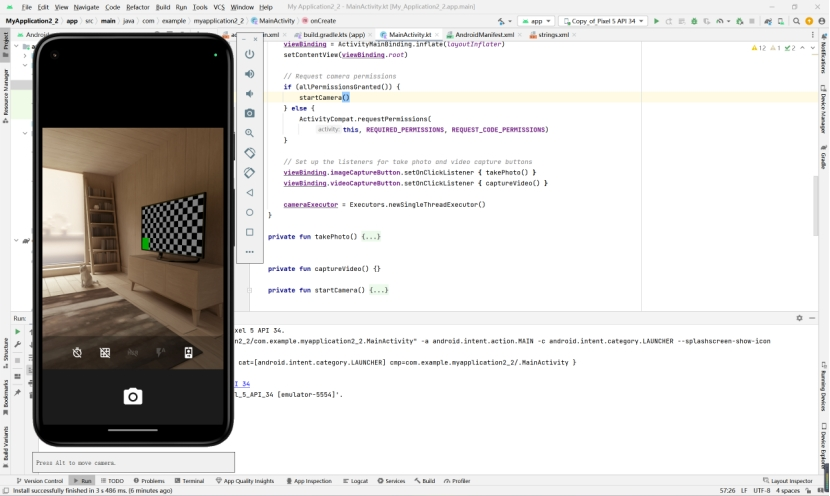
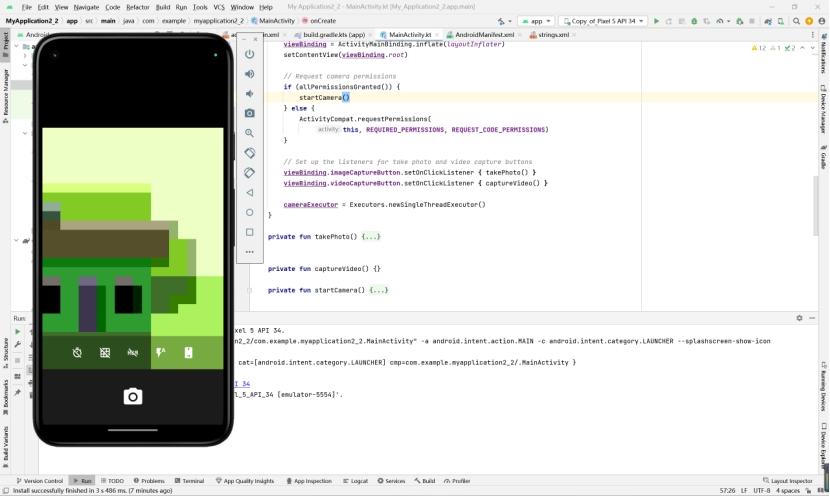
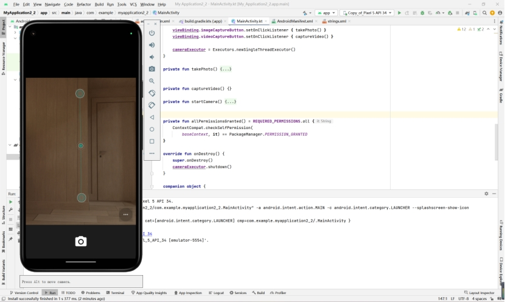

# 实验2_2

## 1.创建项目

首先创建一个新项目，选择“Empty Activity”。


### 2.添加 Gradle 依赖

打开项目的模块（Module）的build.gradle 文件，并添加 CameraX 依赖项：


### 3.创建项目布局

打开res/layout/activity_main.xml 的 activity_main 布局文件，并将其替换为以下代码。

```xml
<?xml version="1.0" encoding="utf-8"?>
<androidx.constraintlayout.widget.ConstraintLayout
   xmlns:android="http://schemas.android.com/apk/res/android"
   xmlns:app="http://schemas.android.com/apk/res-auto"
   xmlns:tools="http://schemas.android.com/tools"
   android:layout_width="match_parent"
   android:layout_height="match_parent"
   tools:context=".MainActivity">

   <androidx.camera.view.PreviewView
       android:id="@+id/viewFinder"
       android:layout_width="match_parent"
       android:layout_height="match_parent" />

   <Button
       android:id="@+id/image_capture_button"
       android:layout_width="110dp"
       android:layout_height="110dp"
       android:layout_marginBottom="50dp"
       android:layout_marginEnd="50dp"
       android:elevation="2dp"
       android:text="@string/take_photo"
       app:layout_constraintBottom_toBottomOf="parent"
       app:layout_constraintLeft_toLeftOf="parent"
       app:layout_constraintEnd_toStartOf="@id/vertical_centerline" />

   <Button
       android:id="@+id/video_capture_button"
       android:layout_width="110dp"
       android:layout_height="110dp"
       android:layout_marginBottom="50dp"
       android:layout_marginStart="50dp"
       android:elevation="2dp"
       android:text="@string/start_capture"
       app:layout_constraintBottom_toBottomOf="parent"
       app:layout_constraintStart_toEndOf="@id/vertical_centerline" />

   <androidx.constraintlayout.widget.Guideline
       android:id="@+id/vertical_centerline"
       android:layout_width="wrap_content"
       android:layout_height="wrap_content"
       android:orientation="vertical"
       app:layout_constraintGuide_percent=".50" />

</androidx.constraintlayout.widget.ConstraintLayout>

```

更新res/values/strings.xml 文件

```xml
<resources>
   <string name="app_name">CameraXApp</string>
   <string name="take_photo">Take Photo</string>
   <string name="start_capture">Start Capture</string>
   <string name="stop_capture">Stop Capture</string>
</resources>

```

布局界面效果如图


### 4.编写 MainActivity.kt 代码

将 MainActivity.kt 中的代码替换为以下代码，但保留软件包名称不变。

```kotlin
package com.android.example.cameraxapp

import android.Manifest
import android.content.ContentValues
import android.content.pm.PackageManager
import android.os.Build
import android.os.Bundle
import android.provider.MediaStore
import androidx.appcompat.app.AppCompatActivity
import androidx.camera.core.ImageCapture
import androidx.camera.video.Recorder
import androidx.camera.video.Recording
import androidx.camera.video.VideoCapture
import androidx.core.app.ActivityCompat
import androidx.core.content.ContextCompat
import com.android.example.cameraxapp.databinding.ActivityMainBinding
import java.util.concurrent.ExecutorService
import java.util.concurrent.Executors
import android.widget.Toast
import androidx.camera.lifecycle.ProcessCameraProvider
import androidx.camera.core.Preview
import androidx.camera.core.CameraSelector
import android.util.Log
import androidx.camera.core.ImageAnalysis
import androidx.camera.core.ImageCaptureException
import androidx.camera.core.ImageProxy
import androidx.camera.video.FallbackStrategy
import androidx.camera.video.MediaStoreOutputOptions
import androidx.camera.video.Quality
import androidx.camera.video.QualitySelector
import androidx.camera.video.VideoRecordEvent
import androidx.core.content.PermissionChecker
import java.nio.ByteBuffer
import java.text.SimpleDateFormat
import java.util.Locale

typealias LumaListener = (luma: Double) -> Unit

class MainActivity : AppCompatActivity() {
   private lateinit var viewBinding: ActivityMainBinding

   private var imageCapture: ImageCapture? = null

   private var videoCapture: VideoCapture<Recorder>? = null
   private var recording: Recording? = null

   private lateinit var cameraExecutor: ExecutorService

   override fun onCreate(savedInstanceState: Bundle?) {
       super.onCreate(savedInstanceState)
       viewBinding = ActivityMainBinding.inflate(layoutInflater)
       setContentView(viewBinding.root)

       // Request camera permissions
       if (allPermissionsGranted()) {
           startCamera()
       } else {
           ActivityCompat.requestPermissions(
               this, REQUIRED_PERMISSIONS, REQUEST_CODE_PERMISSIONS)
       }

       // Set up the listeners for take photo and video capture buttons
       viewBinding.imageCaptureButton.setOnClickListener { takePhoto() }
       viewBinding.videoCaptureButton.setOnClickListener { captureVideo() }

       cameraExecutor = Executors.newSingleThreadExecutor()
   }

   private fun takePhoto() {}

   private fun captureVideo() {}

   private fun startCamera() {}

   private fun allPermissionsGranted() = REQUIRED_PERMISSIONS.all {
       ContextCompat.checkSelfPermission(
           baseContext, it) == PackageManager.PERMISSION_GRANTED
   }

   override fun onDestroy() {
       super.onDestroy()
       cameraExecutor.shutdown()
   }

   companion object {
       private const val TAG = "CameraXApp"
       private const val FILENAME_FORMAT = "yyyy-MM-dd-HH-mm-ss-SSS"
       private const val REQUEST_CODE_PERMISSIONS = 10
       private val REQUIRED_PERMISSIONS =
           mutableListOf (
               Manifest.permission.CAMERA,
               Manifest.permission.RECORD_AUDIO
           ).apply {
               if (Build.VERSION.SDK_INT <= Build.VERSION_CODES.P) {
                   add(Manifest.permission.WRITE_EXTERNAL_STORAGE)
               }
           }.toTypedArray()
   }
}

```

## 5.请求必要的权限

打开 AndroidManifest.xml，然后将以下代码行添加到 application 标记之前。

```xml
<uses-feature android:name="android.hardware.camera.any" />
<uses-permission android:name="android.permission.CAMERA" />
<uses-permission android:name="android.permission.RECORD_AUDIO" />
<uses-permission android:name="android.permission.WRITE_EXTERNAL_STORAGE"
   android:maxSdkVersion="28" />

```


其中第一行android.hardware.camera.any 可确保设备配有相机，指定any表示可以使用前置或者后者摄像头.向MainActivity.kt添加如下代码：

```kotlin
override fun onRequestPermissionsResult(
        requestCode: Int, permissions: Array<String>, grantResults:
        IntArray) {
        super.onRequestPermissionsResult(requestCode, permissions, grantResults)
        if (requestCode == REQUEST_CODE_PERMISSIONS) {
            if (allPermissionsGranted()) {
                startCamera()
            } else {
                Toast.makeText(this,
                    "Permissions not granted by the user.",
                    Toast.LENGTH_SHORT).show()
                finish()
            }
        }
    }
```

运行结果如下：


## 6.实现 Preview 用例

实现startCamera() 函数，代码如下：

```kotlin
private fun startCamera() {
        val cameraProviderFuture = ProcessCameraProvider.getInstance(this)

        cameraProviderFuture.addListener({
            // Used to bind the lifecycle of cameras to the lifecycle owner
            val cameraProvider: ProcessCameraProvider = cameraProviderFuture.get()

            // Preview
            val preview = Preview.Builder()
                .build()
                .also {
                    it.setSurfaceProvider(viewBinding.viewFinder.surfaceProvider)
                }

            imageCapture = ImageCapture.Builder().build()

            val recorder = Recorder.Builder()
                .setQualitySelector(QualitySelector.from(Quality.HIGHEST))
                .build()
            videoCapture = VideoCapture.withOutput(recorder)


            // Select back camera as a default
            val cameraSelector = CameraSelector.DEFAULT_BACK_CAMERA

            try {
                // Unbind use cases before rebinding
                cameraProvider.unbindAll()

                // Bind use cases to camera
                cameraProvider.bindToLifecycle(this, cameraSelector, preview, videoCapture)


            } catch(exc: Exception) {
                Log.e(TAG, "Use case binding failed", exc)
            }

        }, ContextCompat.getMainExecutor(this))
    }
```

## 7.实现 ImageCapture 用例（拍照功能）

该方法会在用户按下 photo 按钮时调用。填充takePhoto() 方法的代码如下：

```kotlin
private fun takePhoto() {
        // Get a stable reference of the modifiable image capture use case
        val imageCapture = imageCapture ?: return

        // Create time stamped name and MediaStore entry.
        val name = SimpleDateFormat(FILENAME_FORMAT, Locale.US)
            .format(System.currentTimeMillis())
        val contentValues = ContentValues().apply {
            put(MediaStore.MediaColumns.DISPLAY_NAME, name)
            put(MediaStore.MediaColumns.MIME_TYPE, "image/jpeg")
            if(Build.VERSION.SDK_INT > Build.VERSION_CODES.P) {
                put(MediaStore.Images.Media.RELATIVE_PATH, "Pictures/CameraX-Image")
            }
        }

        // Create output options object which contains file + metadata
        val outputOptions = ImageCapture.OutputFileOptions
            .Builder(contentResolver,
                MediaStore.Images.Media.EXTERNAL_CONTENT_URI,
                contentValues)
            .build()

        // Set up image capture listener, which is triggered after photo has
        // been taken
        imageCapture.takePicture(
            outputOptions,
            ContextCompat.getMainExecutor(this),
            object : ImageCapture.OnImageSavedCallback {
                override fun onError(exc: ImageCaptureException) {
                    Log.e(TAG, "Photo capture failed: ${exc.message}", exc)
                }

                override fun
                        onImageSaved(output: ImageCapture.OutputFileResults){
                    val msg = "Photo capture succeeded: ${output.savedUri}"
                    Toast.makeText(baseContext, msg, Toast.LENGTH_SHORT).show()
                    Log.d(TAG, msg)
                }
            }
        )
    }
```


## 8.实现 ImageAnalysis 用例

该用例用来处理图像，实现代码如下：

```kotlin
private class LuminosityAnalyzer(private val listener: LumaListener) : ImageAnalysis.Analyzer {

   private fun ByteBuffer.toByteArray(): ByteArray {
       rewind()    // Rewind the buffer to zero
       val data = ByteArray(remaining())
       get(data)   // Copy the buffer into a byte array
       return data // Return the byte array
   }

   override fun analyze(image: ImageProxy) {

       val buffer = image.planes[0].buffer
       val data = buffer.toByteArray()
       val pixels = data.map { it.toInt() and 0xFF }
       val luma = pixels.average()

       listener(luma)

       image.close()
   }
}

```

最终运行效果：

后置

 

前置

 


基准线

